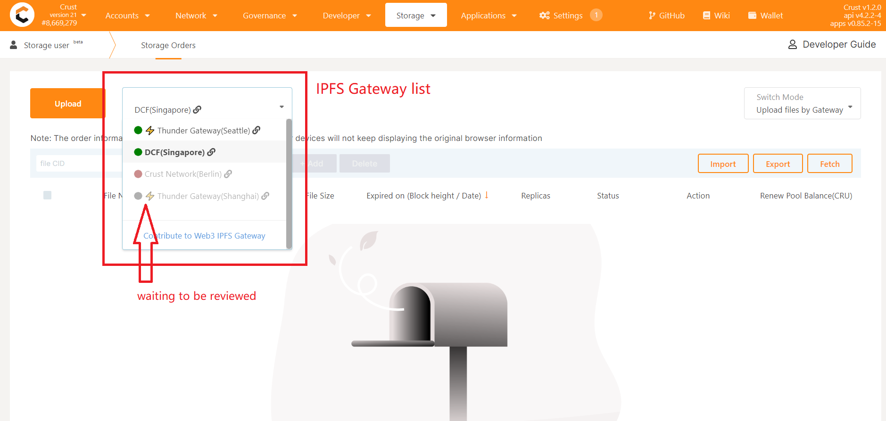

# Existing gateway

You can view existing gateways [here](./index.ts)

# IPFS Public Gateway Endpoints

Here you can contribute your IPFS W3Auth gateway to Crust Apps, it will show like below:



Among them, the green icon indicates that it is running, and the red icon indicates that the gateway has errors waiting to be fixed. A gray icon means pending review.


## Contribution Step

### 1. Run IPFS Public Gateway

1. You can refer [this doc](https://docs.ipfs.io/concepts/ipfs-gateway/#gateway-types) to learn the concept of IPFS public gateway
2. Then, you can refer [this doc](https://docs.ipfs.io/how-to/configure-node/#gateway) to config an IPFS gateway node

### 2. Run W3Auth service

Please refer [this doc](https://wiki.crust.network/docs/en/buildIPFSWeb3AuthGW#deploy) to install and config W3Auth service.

### 3. Propose a PR

Please fork this repo, and add your gateway to `index.ts` with the following format

```typescript
{
    value: 'https://crustipfs.xyz',
    text: t('Crust Network'),
    location: t('Singapore'),
    // crustAddress: cTM4JJMox7nbUqa1R6yMDwnqdEJByWDzHtdr1QczT2MqEVC33
}
```
The following is the parameter description
- 'value':    your gateway url
- 'text':     your organization name
- 'location': where is your gateway
- '// crustAddress': for receiving rewards. `Be careful not to forget the double slashes`

Then, after your PR merged, you'll see your gateway on [Crust Apps](https://apps.crust.network/) with gray icon

### 4. Waiting to be reviewed

Please wait patiently for the technical team to review, after the review is passed, your Gateway will be online. Gray icons also turn green. 

Now congratulations, you have made a great contribution to the Crust

