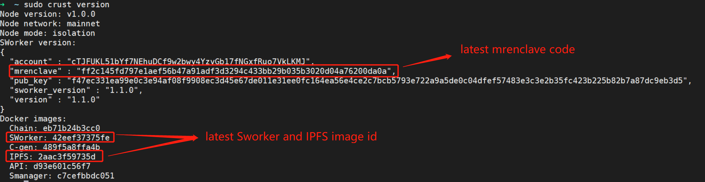

# **1 Instructions**
This article is intended to explain the basic information and upgrade methods of each version to help you successfully complete the version upgrade of sWorker. Here are some basic questions and answers:

Q: Why is there a new version?
- Crust is a constantly updating and evolving network, some functions need to be deploied by updating sWorker

Q: What impact will the old version have when it expires?
- After the old version expires, all workloads will be invalid
- Unable to upgrade to new version

Q: What are the advantages of upgrading to the new version as soon as possible?
- Access new functions as soon as possible to gain advantages on the network
- Fix BUGs in time to avoid error
- Some new versions will suspend on-chain punishment in the early stage to help everyone upgrade smoothly

Q: What is the iteration cycle of sWorker version?
- Generally from six months to one year

Q: What versions are currently available?
- <a href="https://github.com/crustio/crust-sworker/releases/tag/v1.0.0" target="_blank" >V1.0.0 : Frist Version (0xe6f4e6ab58d6ba4ba2f684527354156c009e4969066427ce18735422180b38f4)</a>
- <a href="https://github.com/crustio/crust-sworker/releases/tag/v1.1.0" target="_blank" >V1.1.0 : Support Metaverse (0xff2c145fd797e1aef56b47a91adf3d3294c433bb29b035b3020d04a76200da0a)</a>

# **2 Upgrade guide V1.0.0 -> V1.1.0**

## **2.1 Nodes**
Member node and Isolation node

## **2.2 Time**

Please perform the upgrade operation as soon as possible in the time period of **1600000 blocks ~ 1814600 blocks** and between 0%-60% of each era to avoid the loss of an era's revenue caused by this upgrade. (Note: Upgrading at other times has a 50% probability of losing one era's computing power and income)

##  **2.3 Steps**
### **2.3.1 Upgrade IPFS image**
 

sudo crust tools upgrade-image ipfs

 

### **2.3.2 Restart IPFS service**
 

sudo crust reload ipfs

 

### **2.3.3 sWorker Upgrade**
This process is a continuous process. Generally speaking, it takes time ranging from 100s to 10000s. Please remember not to close the terminal before the upgrade is successful. After the upgrade is successful, the program will automatically exit.
 

sudo crust tools sworker-ab-upgrade ff2c145fd797e1aef56b47a91adf3d3294c433bb29b035b3020d04a76200da0a

 

### **2.3.4 Upgrade status detection**
 

sudo crust version

 

