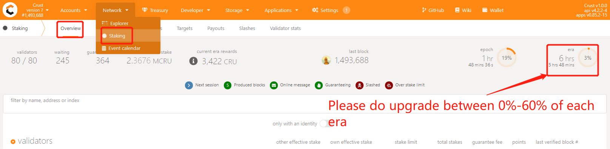
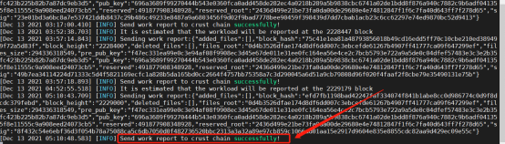
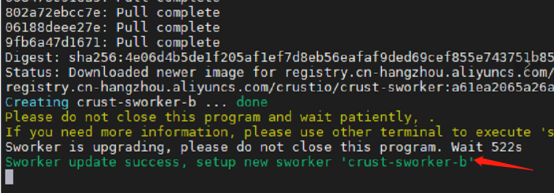
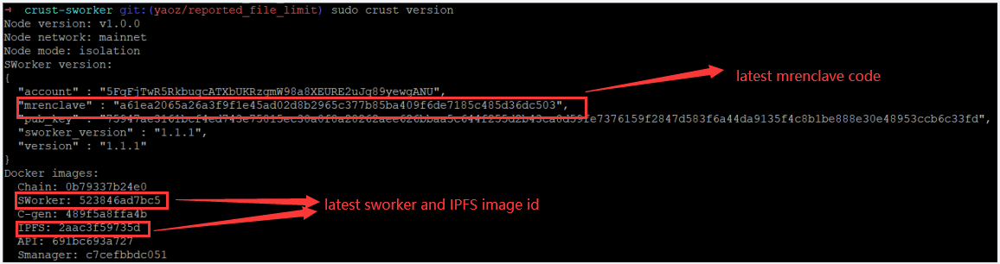

# **1 Instructions**
This article is intended to explain the basic information and upgrade methods of each version to help you successfully complete the version upgrade of sWorker. Here are some basic questions and answers:

Q: Why is there a new version?
- Crust is a constantly updating and evolving network, some functions need to be deploied by updating sWorker

Q: What impact will the old version have when it expires?
- After the old version expires, all workloads will be invalid
- Unable to upgrade to new version

Q: What are the advantages of upgrading to the new version as soon as possible?
- Access new functions as soon as possible to gain advantages on the network
- Fix BUGs in time to avoid error
- Some new versions will suspend on-chain punishment in the early stage to help everyone upgrade smoothly

Q: What is the iteration cycle of sWorker version?
- Generally from six months to one year

Q: What versions are currently available?
- <a href="https://github.com/crustio/crust-sworker/releases/tag/v1.0.0" target="_blank" >V1.0.0 : First Version (0xe6f4e6ab58d6ba4ba2f684527354156c009e4969066427ce18735422180b38f4)</a>
- <a href="https://github.com/crustio/crust-sworker/releases/tag/v1.1.0" target="_blank" >V1.1.0 : Support Metaverse (0xff2c145fd797e1aef56b47a91adf3d3294c433bb29b035b3020d04a76200da0a)</a>
- <a href="https://github.com/crustio/crust-sworker/releases/tag/v1.1.1" target="_blank" >V1.1.1 : Protect Diskdrop (0xa61ea2065a26a3f9f1e45ad02d8b2965c377b85ba409f6de7185c485d36dc503)</a>

# **Nodes**

<text style="color: red">Member and Isolation with normal workload reporting</text>

# **Recommended version**

<text style="color: red">V1.1.1 : Protect Diskdrop (0xa61ea2065a26a3f9f1e45ad02d8b2965c377b85ba409f6de7185c485d36dc503)</text>

# **2 Upgrade guide V1.0.0 -> V1.1.1**

## **2.1 Time**

Please perform the upgrade operation as soon as possible in the time between 0%-60% of each era to avoid the loss of an era's revenue caused by this upgrade. (Note: Upgrading at other times has a 50% probability of losing one era's computing power and income)

##  **2.2 Steps**

### **2.2.1 Check sworker sending work report successfully**
Make sure that the sworker sent the work report successfully in the past hours. If not, please fix the error first before doing the upgrade steps.

Use the following command to check whether the workload is reported successfully

sudo crust logs --tail 10 sworker

 

### **2.2.2 Upgrade IPFS image**
 

sudo crust tools upgrade-image ipfs

 

### **2.2.3 Restart IPFS service**
 

sudo crust reload ipfs

 

### **2.2.4 sWorker Upgrade**
The upgrade process is a background process, which takes time ranging from 1000s to 10000s. <text style="color: red">**It is strongly recommended to execute the upgrade command manually**</text> to avoid unnecessary errors. If the upgrade is abnormal, <text style="color: red">**do not restart the sworker service, which will cause data loss**</text>. 
 

nohup sudo crust tools sworker-ab-upgrade a61ea2065a26a3f9f1e45ad02d8b2965c377b85ba409f6de7185c485d36dc503 > upgrade.log 2>&1 &

 

## **2.3 Upgrade status detection**
 

tail 100 upgrade.log -f

 

sudo crust version

 

# **3 Upgrade guide V1.1.0 -> V1.1.1**

##  **3.1 Steps**

### **3.1.1 Check sworker sending work report successfully**
Make sure that the sworker sent the work report successfully in the past hours. If not, please fix the error first before doing the upgrade steps.

Use the following command to check whether the workload is reported successfully

sudo crust logs --tail 10 sworker

 

### **3.1.2 sWorker Upgrade**
The upgrade process is a background process, which takes time ranging from 1000s to 10000s. <text style="color: red">**It is strongly recommended to execute the upgrade command manually**</text> to avoid unnecessary errors. If the upgrade is abnormal, <text style="color: red">**do not restart the sworker service, which will cause data loss**</text>. 
 

nohup sudo crust tools sworker-ab-upgrade a61ea2065a26a3f9f1e45ad02d8b2965c377b85ba409f6de7185c485d36dc503 > upgrade.log 2>&1 &

 

## **3.2 Upgrade status detection**
 

tail 100 upgrade.log -f

 

sudo crust version

 

