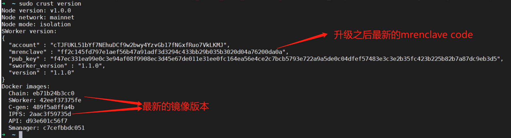

# **1 sWorker版本与升级说明**
本文意在说明各版本的基础信息和升级方式，来帮助大家顺利完成sWorker的版本升级。下面是一些基础的问答：

- 问：为什么会有新版本？
  - Crust是一个不断更新与进化的网络，有些功能需要通过更新sWorker的方式进行升级

- 问：老版本过期后会产生什么影响？ 
  - 老版本在过期之后，所有的工作量都会无效
  - 无法进行升级

- 问：尽快升级新版本的优势？
  - 尽快接入新功能，获得网络上的优势
  - 及时修复BUGs，避免损失
  - 部分新版本前期会暂停链上惩罚，协助大家顺利升级

- 问：sWorker版本迭代周期？
  - 一般在半年到一年 

- 问：目前有哪些可用的版本？
  - [V1.0.0 : Frist Version (0xe6f4e6ab58d6ba4ba2f684527354156c009e4969066427ce18735422180b38f4)](https://github.com/crustio/crust-sworker/releases/tag/v1.0.0)
  - [V1.1.0 : Support IPFS CID V1 (0xff2c145fd797e1aef56b47a91adf3d3294c433bb29b035b3020d04a76200da0a)](https://github.com/crustio/crust-sworker/releases/tag/v1.1.0)

# **2 升级指南 V1.0.0 -> V1.1.0**

## **2.1 升级对象**
Member 节点，Isolation 节点

## **2.2 升级时间**

请尽快在** 1541000 blocks ~ 1742600 blocks **时间段，以及每个era的0%-60%之间进行升级操作，来避免本次升级带来的一个era收益损失。(注：其他时间升级有50%的概率损失一个era的算力和收益)

##  **2.3 升级步骤**
### **2.3.1 更新IPFS镜像**

 

sudo crust tools upgrade-image ipfs

 

### **2.3.2 重启IPFS服务**
 

sudo crust reload ipfs

 

### **2.3.3 sWorker升级**
此过程是一个持续的过程，耗时在100s-3600s不等，升级成功之前请切记不能关闭终端，升级成功之后程序自动退出.
 

sudo crust tools sworker-ab-upgrade ff2c145fd797e1aef56b47a91adf3d3294c433bb29b035b3020d04a76200da0a

 

## **2.3.4 升级状态检测**

 

sudo crust version

 

