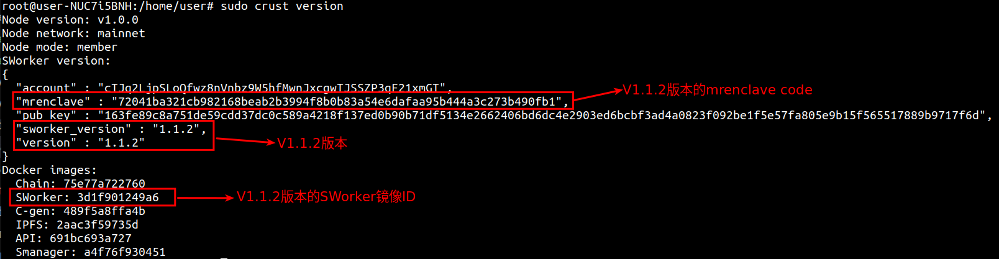
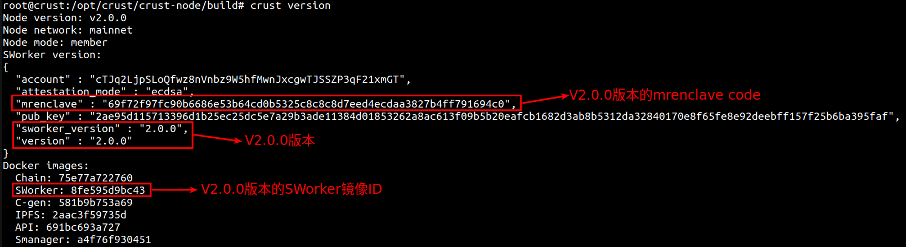

# **1 sWorker版本与升级说明**
本文意在说明各版本的基础信息和升级方式，来帮助大家顺利完成sWorker的版本升级。下面是一些基础的问答：

问：为什么会有新版本？
- Crust是一个不断更新与进化的网络，有些功能需要通过更新sWorker的方式进行升级

问：老版本过期后会产生什么影响？ 
- 老版本在过期之后，所有的工作量都会无效
- 无法进行升级

问：尽快升级新版本的优势？
- 尽快接入新功能，获得网络上的优势
- 及时修复BUGs，避免损失
- 部分新版本前期会暂停链上惩罚，协助大家顺利升级

问：sWorker版本迭代周期？
- 一般在半年到一年 

问：目前有哪些可用的版本？
- <a href="https://github.com/crustio/crust-sworker/releases/tag/v1.0.0" target="_blank" >V1.0.0 : First Version (0xe6f4e6ab58d6ba4ba2f684527354156c009e4969066427ce18735422180b38f4)</a>
- <a href="https://github.com/crustio/crust-sworker/releases/tag/v1.1.0" target="_blank" >V1.1.0 : Support Metaverse (0xff2c145fd797e1aef56b47a91adf3d3294c433bb29b035b3020d04a76200da0a)</a>
- <a href="https://github.com/crustio/crust-sworker/releases/tag/v1.1.1" target="_blank" >V1.1.1 : Protect Diskdrop (0xa61ea2065a26a3f9f1e45ad02d8b2965c377b85ba409f6de7185c485d36dc503)</a>
- <a href="https://github.com/crustio/crust-sworker/releases/tag/v1.1.2" target="_blank" >V1.1.2 : Fix Bugs (0x72041ba321cb982168beab2b3994f8b0b83a54e6dafaa95b444a3c273b490fb1)</a>
- <a href="https://github.com/crustio/crust-sworker/releases/tag/v2.0.0" target="_blank" >V2.0.0 : Support ECDSA DCAP Attestation (0x69f72f97fc90b6686e53b64cd0b5325c8c8c8d7eed4ecdaa3827b4ff791694c0)</a>

# **升级对象**

<text style="color: red">工作量上报正常的Member 节点，Isolation 节点</text>

# **推荐版本**

<text style="color: red">V1.1.2 : Fix Bugs (0x72041ba321cb982168beab2b3994f8b0b83a54e6dafaa95b444a3c273b490fb1)</text>

# **Upgrade Guides**
- [V1.0.0->V1.1.1](#v100tov111)
- [V1.1.0->V1.1.1](#v110tov111)
- [V1.1.0/V1.1.1->V1.1.2](#v111tov112)
- [V1.x.x->V2.0.0](#v1xxtov200)

# **2 升级指南 V1.0.0 -> V1.1.1** 

## **2.1 升级时间**

请尽快在每个era的0%-60%之间进行升级操作，来避免本次升级带来的一个era收益损失。(注：其他时间升级有50%的概率损失一个era的算力和收益)

##  **2.2 升级步骤**
### **2.2.1 确认sworker上报工作量正常**

通过sworker日志文件来确认近期工作量处于正常上报状态。如不正常，请优先修复后再进行升级操作。
通过命令查询工作量是否上报成功
 

sudo crust logs --tail 100 sworker

 

### **2.2.2 更新IPFS镜像** 
 

sudo crust tools upgrade-image ipfs

 

### **2.2.3 重启IPFS服务**

 

sudo crust reload ipfs

 

### **2.2.4 sWorker升级**
 

 升级过程是一个后台进程，耗时在100s-10000s不等，<text style="color: red">**强烈建议手动执行升级命令**</text>，避免出现不必要的错误，如果升级出现异常，<text style="color: red">**切记不能reload sworker服务，以防数据丢失**</text>。 

<text style="color: red">**注意:**</text>
 
<text style="color: red">**升级期间不要执行'crust reload sworker'操作，这可能会引起数据丢失，从而导致需要重新SRD整个磁盘。**</text>

 

nohup sudo crust tools sworker-ab-upgrade a61ea2065a26a3f9f1e45ad02d8b2965c377b85ba409f6de7185c485d36dc503 > upgrade.log 2>&1 &

 

## **2.3 升级状态检测**
 

tail 100 upgrade.log -f

 

sudo crust version

 

# **3 升级指南 V1.1.0 -> V1.1.1** 

##  **3.1 升级步骤**

### **3.1.1 确认sworker上报工作量正常**
通过sworker日志文件来确认近期工作量处于正常上报状态。如不正常，请优先修复后再进行升级操作。
通过命令查询工作量是否上报成功
 

sudo crust logs --tail 100 sworker

 

### **3.1.2 sWorker升级**
 

 升级过程是一个后台进程，耗时在100s-10000s不等，<text style="color: red">**强烈建议手动执行升级命令**</text>，避免出现不必要的错误，如果升级出现异常，<text style="color: red">**切记不能reload sworker服务，以防数据丢失**</text>。 

<text style="color: red">**注意:**</text>
 
<text style="color: red">**升级期间不要执行'crust reload sworker'操作，这可能会引起数据丢失，从而导致需要重新SRD整个磁盘。**</text>

 

nohup sudo crust tools sworker-ab-upgrade a61ea2065a26a3f9f1e45ad02d8b2965c377b85ba409f6de7185c485d36dc503 > upgrade.log 2>&1 &

 

## **3.2 升级状态检测**
 

tail 100 upgrade.log -f

 

sudo crust version

 

# **4 升级指南 V1.1.0/V1.1.1 -> V1.1.2** 

##  **4.1 升级步骤**

### **4.1.1 确认sworker上报工作量正常**
通过sworker日志文件来确认近期工作量处于正常上报状态。如不正常，请优先修复后再进行升级操作。
通过命令查询工作量是否上报成功
 

sudo crust logs --tail 100 sworker

 

### **4.1.2 sWorker升级**
 

 升级过程是一个后台进程，耗时在100s-10000s不等，<text style="color: red">**强烈建议手动执行升级命令**</text>，避免出现不必要的错误，如果升级出现异常，<text style="color: red">**切记不能reload sworker服务，以防数据丢失**</text>。 

<text style="color: red">**注意:**</text>
 
<text style="color: red">**升级期间不要执行'crust reload sworker'操作，这可能会引起数据丢失，从而导致需要重新SRD整个磁盘。**</text>

 

nohup sudo crust tools sworker-ab-upgrade 72041ba321cb982168beab2b3994f8b0b83a54e6dafaa95b444a3c273b490fb1 > upgrade.log 2>&1 &

 

## **4.2 升级状态检测**
 

tail 100 upgrade.log -f

 

sudo crust version

 

# **5 升级指南 V1.x.x -> V2.0.0** 

##  **5.1 升级步骤**

## 注意：

sworker v2.0.0版本支持基于ECDSA的DCAP认证，同时兼容即将过期的EPID IAS认证，所以你可以直接从旧版本v1.x直接升级到v2.0.0，不会触发重新入网。

但是如果要对新服务器入网或者旧服务器重新入网时使用ECDSA-based DCAP attestation，请按照[Crust Wiki: EPID & ECDSA](https://wiki.crust.network/docs/zh-CN/Q&AForEPID-ECDSA)中的说明进行。

### **5.1.1 确认sworker上报工作量正常**
通过sworker日志文件来确认近期工作量处于正常上报状态。如不正常，请优先修复后再进行升级操作。
通过命令查询工作量是否上报成功
 

sudo crust logs --tail 100 sworker

 

### **5.1.2 sWorker升级**
 

 升级过程是一个后台进程，耗时在100s-10000s不等，<text style="color: red">**强烈建议手动执行升级命令**</text>，避免出现不必要的错误，如果升级出现异常，<text style="color: red">**切记不能reload sworker服务，以防数据丢失**</text>。 

<text style="color: red">**注意:**</text>
 
<text style="color: red">**升级期间不要执行'crust reload sworker'操作，这可能会引起数据丢失，从而导致需要重新SRD整个磁盘。**</text>

 

nohup sudo crust tools sworker-ab-upgrade 69f72f97fc90b6686e53b64cd0b5325c8c8c8d7eed4ecdaa3827b4ff791694c0 > upgrade.log 2>&1 &

 

## **5.2 升级状态检测**
 

tail 100 upgrade.log -f

 

sudo crust version

 

